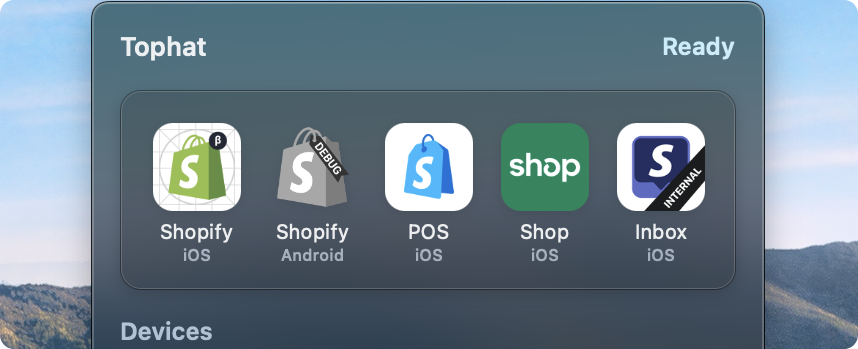
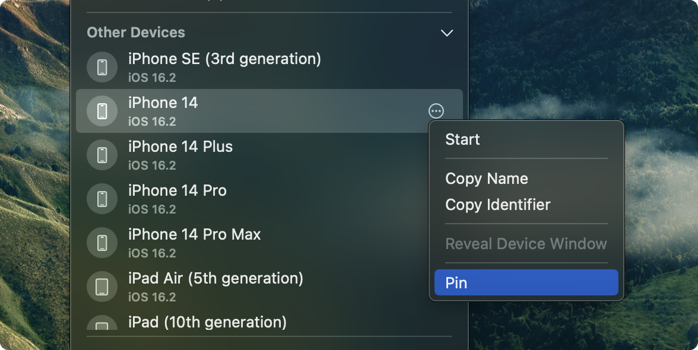
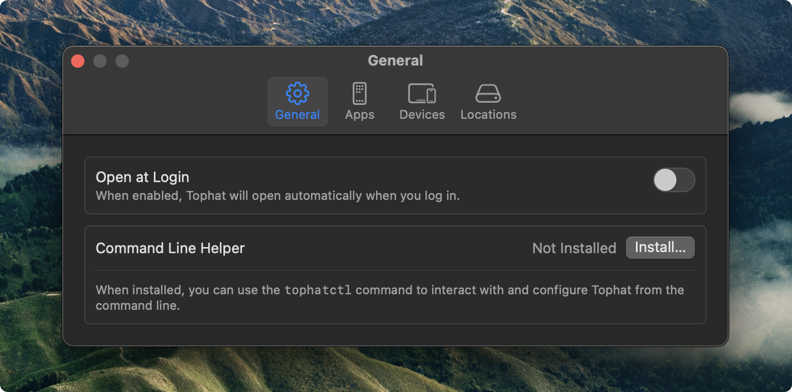
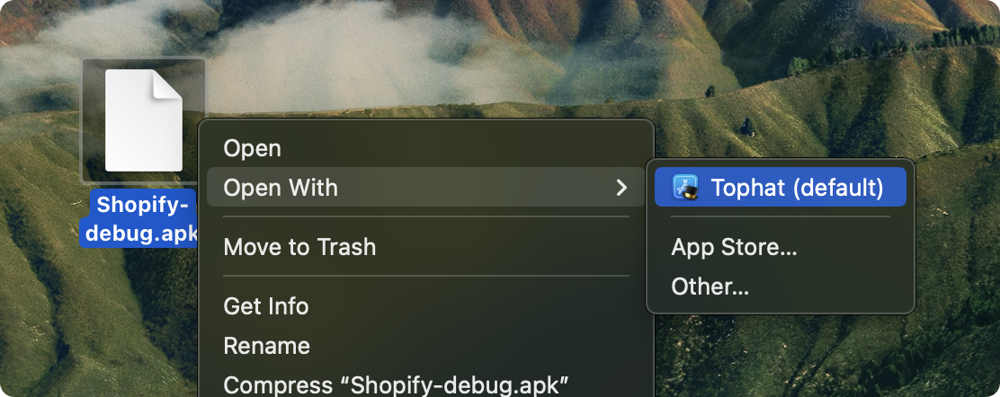

<h1 align="center">
  
  <br>
  Tophat 
  <br>
</h1>

<p align="center">
  As seen on the <a href="https://shopify.engineering/shopify-tophat-mobile-developer-testing">Shopify Engineering Blog</a>!
</p>


<p align="center">
  <strong>Tophat is the best way to install and test any mobile application. Just add CI.</strong>
</p>

### One-Click Installation

With Tophat, you can skip building branches locally. Tophat hosts a lightweight web server, allowing you to easily add Tophat links to your CI pipeline and launch apps right from GitHub.

### Quick Launch

Quick Launch allows you to add your favourite apps right in the Tophat menu. Need the latest build? Click on the icon and go! Tophat will download the latest version, update the icon, and launch it on your device.

<p align="center">
  
</p>

### Device Pinning

Have lots of devices and only use a couple at a time? Easily pin them to the top of the devices list for quick access.

<p align="center">
  
</p>

### Customize

Customize Tophat to your needs with the Settings window. Adjust preferences, add apps to Quick Launch, or even specify custom tooling paths to make Tophat work for your environment.

<p align="center">
  
</p>

## Integrating Tophat

There are a number of ways to interact with Tophat so that you can integrate it into your project with ease.

### GitHub

Tophat features a lightweight web server so that you can launch apps using CI artifacts. To handle builds that use separate artifacts for different device types, specify a `virtual` URL that points to a simulator-only build, and a `physical` URL that points to a device-only build:

```
http://localhost:29070/install/<ios|android>?virtual=https://url/to/virtual&physical=https://url/to/physical
```

Or, for universal builds that work on all device types, use the `universal` query param:

```
http://localhost:29070/install/<ios|android>?universal=https://url/to/virtual
```

You can also specify arguments to pass to the application on launch using the `launchArguments` query string. For example:

```
&launchArguments=one,two,three
```

On iOS, these arguments are retrievable using `ProcessInfo`. On Android, these arguments are delivered to your appʼs main activity _via_ intent argument extras in the `TOPHAT_ARGUMENTS` key as an array of strings.

### URL Schemes

For applications that support custom URL schemes, use the `tophat://` scheme to launch right into Tophat:

```
tophat://install/<ios|android>?universal=https://url/to/universal
```

URL schemes and handling _via_ web server both use the same URL format.

### Command Line Helper

Tophat can be integrated with various tools and projects using `tophatctl`, Tophatʼs companion command line app. You can use `tophatctl` to perform the following tasks:

- **Manage Quick Launch apps.** Pre-populate Tophat with your projectʼs apps in a `dev up` step.
- **Install apps.** Install an app by URL or path.

For more details on how to use `tophatctl`, run the following command after installing the Command Line Helper:

```sh
tophatctl --help
```

### File Associations

Tophat also adds file associations to `*.ipa`, `*.apk`, and `*.zip` files so you can open artifacts from your device.

<p align="center">
  
</p>

## Getting Started

The easiest way to run Tophat safely is to build it from source by opening `Tophat.xcodeproj` using Xcode. Alternatively, you can download a pre-built (but unsigned) binary of the latest release from the [releases](https://github.com/Shopify/tophat/releases) page.

Tophat requires a few developer tools to be set up. On first launch, Tophat will guide you through making sure everything you need is ready to go.

## Requirements

Tophat requires macOS 14 or later.

### iOS Development

- Xcode 15 or newer is required.
- All simulator versions are supported, but physical devices must be running iOS 17 or later.

### Android Development

Tophat works with Android Studio and Android toolchains with a working `adb` and `avdmanager` environment.

## Contributing

See the [contribution guidelines](CONTRIBUTING.md) for more information.
